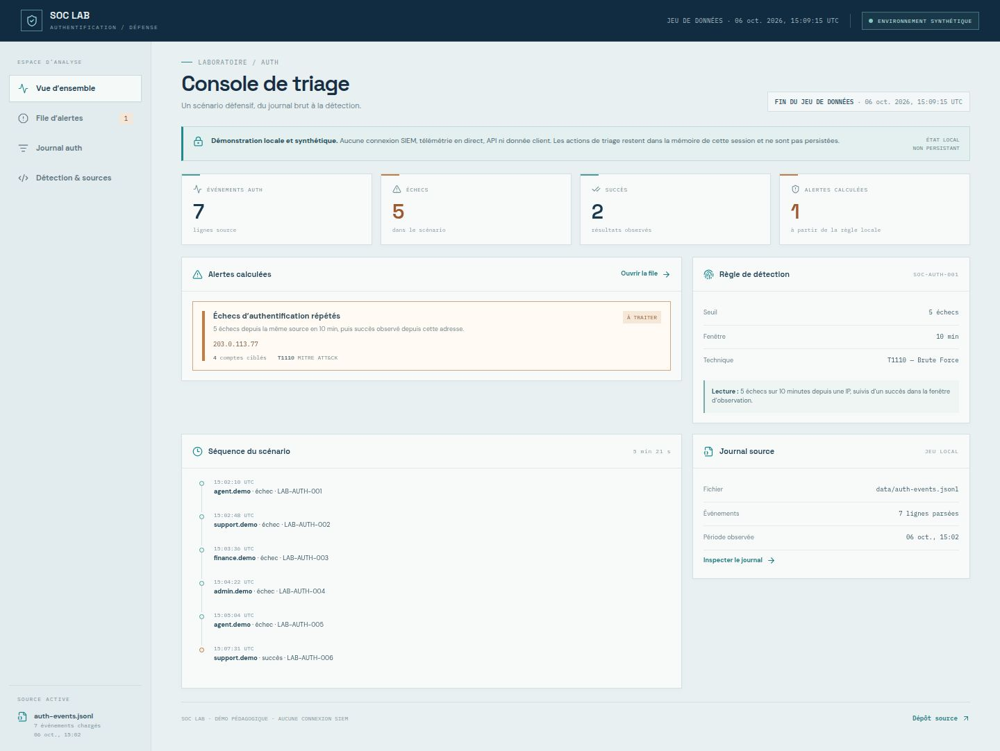

# Laboratoire SOC francophone

Projet pratique de supervision, détection et réponse aux incidents, avec des exemples reproductibles sur des données synthétiques.

**Démo web :** https://mekladeveloppeur.github.io/soc-lab-francophone/



## Scénario de détection

Le jeu de données `data/auth-events.jsonl` contient sept événements fictifs. Cinq échecs depuis une même adresse d'exemple visent quatre comptes en moins de trois minutes ; une authentification réussie depuis cette source suit le dernier échec de deux minutes et vingt-sept secondes. La règle `SOC-AUTH-001` déclenche sur les échecs et rattache le succès ultérieur comme élément de contexte.

Cette séquence justifie une investigation, mais ne prouve pas une compromission. Les journaux ne permettent pas à eux seuls de distinguer le password spraying, d'autres formes de force brute ou une activité autorisée. Les adresses IP appartiennent aux plages réservées à la documentation ; aucun système réel n'est interrogé. Voir l'[étude de cas et son plan de triage](docs/case-studies/auth-abuse.md).

## Ressources du laboratoire

- `tools/detect_bruteforce.py` — détecteur Python exécutable sur le fichier d'événements.
- `detections/wazuh/local-rules.xml` — exemple de règles locales Wazuh.
- `detections/sentinel/auth-failures.kql` — exemple de requête KQL pour Microsoft Sentinel.
- `docs/runbooks/credential-abuse.md` — procédure pédagogique de triage et de réponse.
- `docs/case-studies/auth-abuse.md` — preuves synthétiques, hypothèses et limites du cas.
- `docs/audit/owasp-case.md` — étude OWASP fictive, sans cible réelle.
- `tests/` — tests automatisés du détecteur.

## Exécuter les exemples Python

Prérequis : Python 3.10 ou ultérieur.

```bash
python3 tools/detect_bruteforce.py data/auth-events.jsonl
python3 -m unittest discover -s tests -v
```

Le détecteur lit le fichier fourni et affiche les échecs ainsi que le succès corrélé lorsqu'il se produit dans la fenêtre d'observation. Il ne se connecte ni à Wazuh ni à Sentinel.

## Démonstration web

La démo GitHub Pages analyse le même journal synthétique dans le navigateur. Les filtres et le marquage d'alertes sont locaux à la session ; il n'y a ni compte, ni backend, ni ingestion de télémétrie en direct.

## Limites et usage responsable

- Tous les événements et résultats affichés sont synthétiques et pédagogiques.
- Le scénario n'est pas une mission client ni un travail attribuable à l'ANC de Djibouti.
- Les règles Wazuh et Sentinel sont des exemples à valider dans un environnement de laboratoire autorisé.
- L'étude OWASP ne cible aucun système réel.
- N'ajoutez au dépôt ni données personnelles, ni secrets, ni journaux clients.
- N'effectuez des tests de sécurité que sur des systèmes pour lesquels vous avez une autorisation et un périmètre défini.

## Licence

Les exemples originaux sont distribués sous licence MIT. Les marques Wazuh, Microsoft Sentinel, MITRE ATT&CK et OWASP appartiennent à leurs détenteurs respectifs.
